# 最新在线客服软件汇总(内附多平台功能对比)

网站有流量却转化不了客户?访客看了半天找不到人问?传统邮件客服慢得像蜗牛?这些都是典型的在线沟通问题。一套好用的实时聊天工具能让你在客户最需要帮助的时候出现,把咨询转化成订单。这篇文章整理了2025年市场上值得关注的在线客服平台,覆盖从免费方案到企业级解决方案的各种场景——无论你是刚起步的小团队,还是需要多渠道整合的大公司,都能找到适合自己的客户沟通工具。

***

## **[JivoChat](https://jivochat.com)**

多渠道统一管理的全能型客服平台

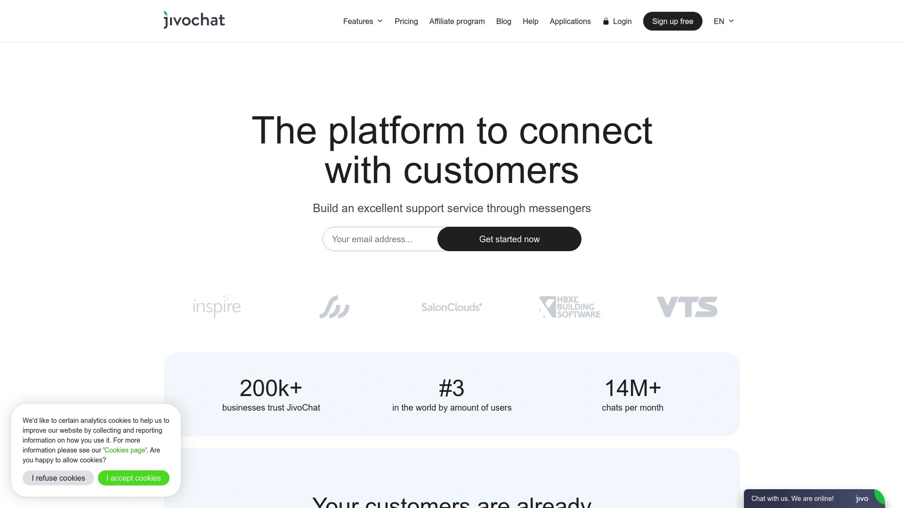

JivoChat把所有客户联系渠道整合到一个地方:网站实时聊天、社交媒体消息、即时通讯工具、电话呼叫。全球20万+企业在用,按用户量计算排名世界第三,每月处理1400万+次对话。这个数据说明平台的稳定性和可靠性都经过了大规模验证。

**安全管理是JivoChat的一大亮点。** 员工离职或手机丢失不再是隐患,因为所有客户联系人都安全存储在平台里,而不是分散在员工的私人设备上。社交媒体账号也不用直接分享给员工——客服通过JivoChat应用回复消息,但接触不到账号密码。某汽车经销商切换到JivoChat管理Instagram后,第一个月销售额增长32%,客户忠诚度明显提升,同时账号安全得到了保障。

聊天机器人功能可以处理常见问题,让人工客服专注于复杂需求。API接口支持开发者将聊天功能嵌入网站或Web应用,也可以集成到现有的CRM系统。数据分析功能覆盖销售漏斗各个阶段,能查看访客来源、评估各渠道效果、监控客服KPI、优化服务流程。适合需要全方位客户沟通管理的中小型企业。

***

## **[LiveChat](https://www.livechat.com)**

功能全面的行业标杆级客服软件

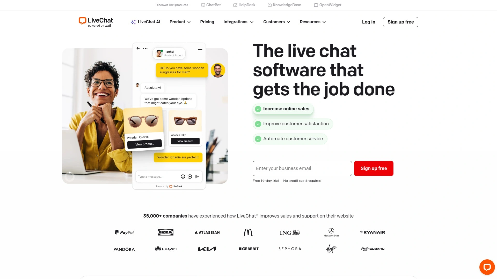

LiveChat在行业里做了很多年,功能完整度很高。安装过程只需要几秒钟,界面设计现代简洁,上手几乎没有障碍。所有套餐都包含全年无休的客服支持,还有详细的知识库和AI助手。

聊天控制台功能很强大:消息预览(客户还在打字时就能看到内容)、聊天转接、对话记录自动保存。可以主动联系正在浏览网站的访客,或者根据访客所在页面将其分配给特定客服——比如在定价页面的访客直接对接销售团队。

**异步模式特别实用。** 客户在非工作时间发送消息,会进入队列等待处理;客服回复后,消息同时发送到聊天窗口和客户邮箱。这样即使时差或工作时间不同,沟通也不会中断。AI副驾驶功能可以根据你的帮助文档建议回复内容,预设回复模板加快响应速度。通过Zapier集成,可以连接几千个其他应用,比如自动将LiveChat联系人添加到HubSpot,或在Google表格追踪对话记录。价格相对较高,多用户使用成本会上升,但功能确实全面。

***

## **[tawk.to](https://www.tawk.to)**

永久免费的功能齐全客服方案

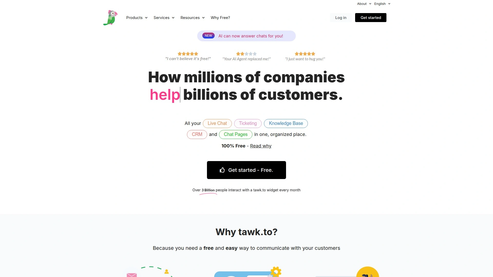

tawk.to最大的特点就是免费——不是试用期免费,是永久免费。无限用户、自动触发、消息低语、知识库,这些功能全都不收费。除非你需要额外功能:AI辅助(29美元/月)、视频+语音+屏幕共享(29美元/月)、雇佣真人客服处理聊天(1美元/小时)、移除品牌标识(29美元/月)。

聊天小部件完全可定制,可以设置在网站哪些位置显示、什么时候显示、如何通知。支持声音提醒、消息预览、预计等待时间显示。还有同意表单选项和计划程序,自动启用或禁用聊天功能。

知识库功能允许你创建子域名(比如yourcompany.tawk.to.help)分享帮助文章,既可以给客户用,也能作为内部客服资料。可以自定义logo、颜色、社交分享等元素。客户搜索不到答案时,可以直接提交工单,工单会出现在你的消息收件箱,分配给对应客服处理。对于刚起步或预算紧张的小企业来说,tawk.to是个很实惠的选择。品牌标识比其他免费工具更显眼一些,但考虑到功能,这点可以接受。

***

## **[Tidio](https://www.tidio.com)**

拖放式聊天机器人构建器,零代码上手

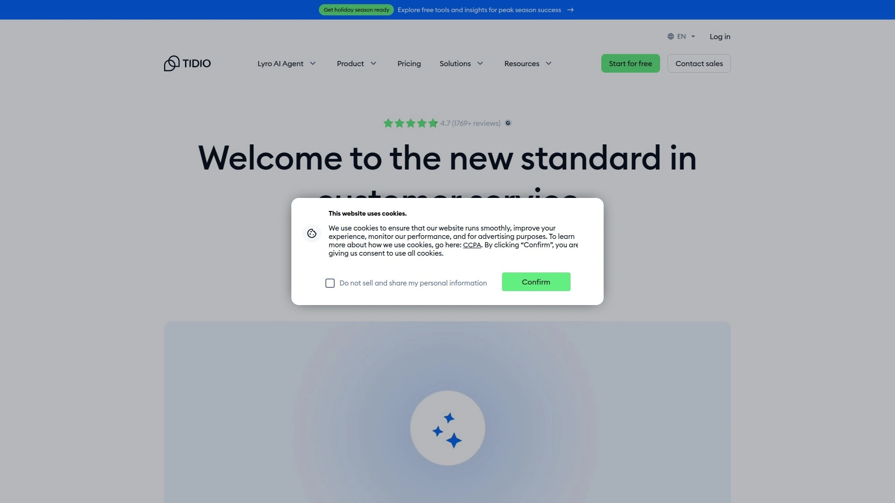

Tidio特别适合小团队需要全天候支持的场景。拖放式构建器非常友好,几分钟就能在网站上安装并自定义聊天弹窗,匹配品牌风格。可以查看网站所有访客,实时看到客户正在输入的内容,提前准备回复,加快响应速度。

除了实时聊天,Tidio的聊天机器人能用AI自动处理最多70%的客户问题。平台提供35个以上的现成机器人模板:新访客折扣、收集访客信息、产品推荐、购物车挽回、常见问题解答等。不需要编程基础,用拖放工具就能定制模板或创建自己的机器人。

Tidio提供桌面和移动应用,还有浏览器小部件,随时随地都能跟客户保持联系。无缝集成WordPress、WooCommerce、Shopify、Squarespace等主流平台。免费版支持3个客服,但每月只有50次实时聊天对话。付费套餐从29美元/月起,包含更多高级功能。移除品牌标识需要升级到最贵的套餐。

***

## **[Intercom](https://www.intercom.com)**

现代化消息优先的客户互动平台

Intercom在2011年推出,比Zendesk晚几年,但以消息优先的理念快速建立了口碑。G2评分4.5星,用户特别称赞其易用性和功能丰富度。集成虽然不如Zendesk广泛,但与现代通讯和商业工具无缝配合,比如WhatsApp、Salesforce、HubSpot、Google Analytics。

应用内聊天、自动化聊天机器人、统一查询收件箱,Intercom把这些功能整合得很流畅。外观现代,体验顺滑,深受SaaS公司、初创企业和注重客户体验的企业喜爱。自动化能力很强:自定义收件箱规则、定向消息、基于客户细分的动态触发器。

Intercom在销售和市场方面的功能比纯客服工具更突出,适合需要在客户生命周期各个阶段互动的企业。定价按对话数量收费,随着支持量增长,成本上升速度可能比按坐席收费的模式更快。有用户抱怨账单不够透明,选择前需要仔细了解定价细节。

***

## **[Zendesk](https://www.zendesk.com)**

强大的工单系统和全渠道支持

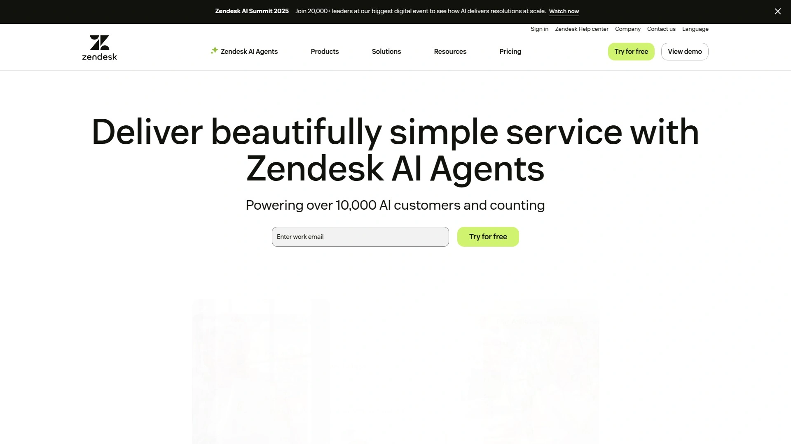

Zendesk是客服软件领域的老牌企业,工单管理功能非常完善。将来自邮件、电话、网站、聊天、社交媒体的客户咨询汇集到统一平台,确保不会遗漏任何一条消息。工单自动分配可以根据技能、负载均衡、轮询等多种方式配置。

触发器、宏命令、自动化规则让你智能路由工单、设置状态、自动执行重复任务。实时通讯和应用内通知保持客服团队同步。不过相比其他平台,Zendesk的自动化需要前期投入更多配置工作,才能发挥最大效果。

报告和分析功能深入,支持自定义各种维度的数据导出。Zendesk Support Suite适合需要深度工单管理和全面报告的中大型企业。集成能力很强,几乎能连接市场上所有主流商业软件。多语言支持只在高级套餐提供,API访问所有付费套餐都包含。定价相对较高,但功能确实全面。

***

## **[Freshchat](https://www.freshworks.com/live-chat-software/)**

AI驱动的多渠道消息平台

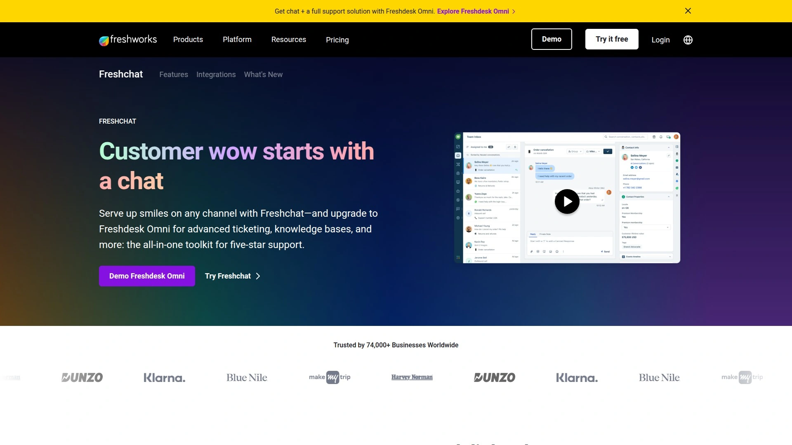

Freshchat是Freshworks旗下的客户消息解决方案,集成了Freddy AI助手来简化客户问题处理。统一管理Facebook Messenger、Instagram DM、WhatsApp、Telegram、邮件等渠道的消息,所有对话在一个后台处理。

拖放式对话设计器不需要编程基础,可以轻松创建聊天和调查模板。实时翻译支持33种以上语言,服务全球客户没有语言障碍。电商兼容性很好,与Shopify、WooCommerce、Stripe无缝集成,方便处理购物相关咨询。

自动化工作流通过Automations应用创建高效聊天流程,优化客户互动。集中式文件存储和营业时间管理工具帮助高效安排客户服务时间表。跨平台支持Android、iOS、Mac、Windows,客服可以在任何设备上工作。适合自由职业者到大型企业的各种规模用户。

***

## **[Drift](https://www.drift.com)**

对话式营销和销售加速平台

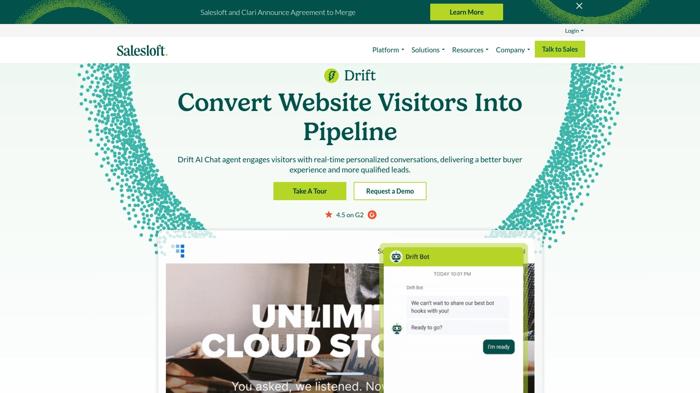

Drift不只是客服工具,更侧重于营销和销售场景。实时与网站访客对话,但重点是资格认证和转化。聊天机器人根据预设标准自动识别潜在客户,节省销售团队时间。日历集成功能自动预约会议,简化跟进流程。

线索评分系统根据访客互动行为分配分数,帮助销售团队确定优先级。与HubSpot无缝集成,新联系人从Drift自动同步到HubSpot数据库,对话关闭时同步联系人属性并分配线索负责人。HubSpot联系人时间线会显示所有Drift活动,销售可以根据特定行为(比如查看定价页)定制跟进策略。

Drift专注于为网站访客创建个性化即时体验,对于需要扩大转化率的企业来说提升明显。定价相对较高,Pro套餐起步,更适合有一定预算、重视转化效率的B2B公司和SaaS企业。

***

## **[HubSpot](https://www.hubspot.com)**

CRM生态系统中的免费实时聊天

HubSpot的实时聊天功能是其CRM生态的一部分,最大优势是与他们的营销、销售、服务工具深度整合。聊天机器人可以回答常见问题、线索认证、安排会议。与WhatsApp、Slack等平台连接,扩大触达范围。

大规模个性化对话是HubSpot的强项。与CRM集成后,客服能看到访客的完整历史记录:之前的互动、购买记录、浏览行为。这些信息帮助客服提供更有针对性的帮助。工作流自动化可以根据聊天内容触发后续动作,比如发送邮件、创建任务等。

HubSpot的实时聊天本身免费,但要充分利用高级功能,通常需要订阅他们的付费套餐。如果你已经在使用HubSpot的其他产品(营销自动化、销售管道管理等),那么聊天功能的整合价值很高。对于没用过HubSpot生态的企业,单独使用聊天功能可能体验不到最大优势。

***

## **[Olark](https://www.olark.com)**

简洁直接的聊天解决方案

Olark提供直接了当的实时聊天功能,没有太多复杂花哨的东西。设置简单,界面清晰,适合需要基本聊天功能的团队。访客监控功能显示谁在浏览知识库、他们的位置、正在查看的页面。客服可以在合适时机主动联系访客。

共同浏览功能让客服看到客户的屏幕,控制浏览器,直接引导他们找到相关知识库文章。这个功能在处理复杂问题时特别有用,避免了反复描述的麻烦。可以在对话中分享文件,发送截图或PDF,节省解释时间。

Olark与ProProfs知识库等工具集成良好,客服可以快速分享自助服务文章。定价从29美元/月起,功能覆盖基本需求。如果你不需要AI机器人、深度分析这些高级功能,只想要一个可靠的实时聊天工具,Olark是个实用的选择。

---

## **[LiveAgent](https://www.liveagent.com)**

简单易用且功能丰富的客服系统

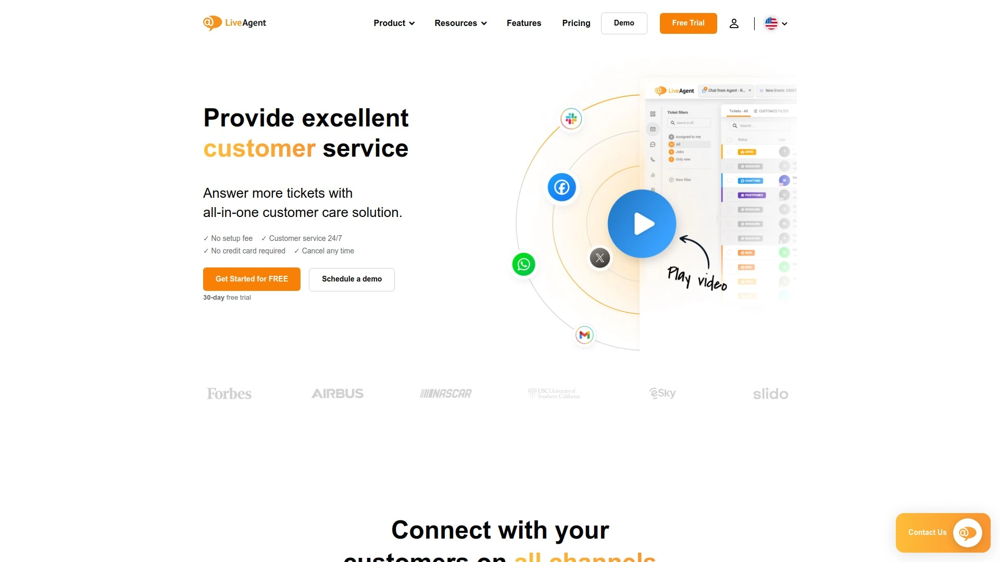

LiveAgent是一个客户支持软件,实时聊天只是其中一个功能模块。聊天窗口可以自定义按钮、颜色、样式来匹配品牌形象。客服可以创建预设回复快速处理常见问题,实时打字预览功能让客服在客户发送前就看到消息内容。

工单自动路由支持多种分配方式:随机分配、基于客服工作量分配等。主动聊天邀请功能自动吸引访客参与对话。追踪客户信息包括聊天历史、网站停留时间、地理位置、IP地址。

通用收件箱让客服在一个地方处理来自邮件、社交媒体等多个渠道的消息。内置CRM存储客户姓名、过往购买记录、之前的支持互动,方便个性化服务。报告和分析功能完善,支持AI特性,但需要连接自己的OpenAI账户。起步价15美元/坐席/月(按年付费),提供14天免费试用。游戏化功能激励客服保持积极性。

***

## **[ProProfs Chat](https://www.proprofschat.com)**

24/7 AI聊天机器人增强的客户支持

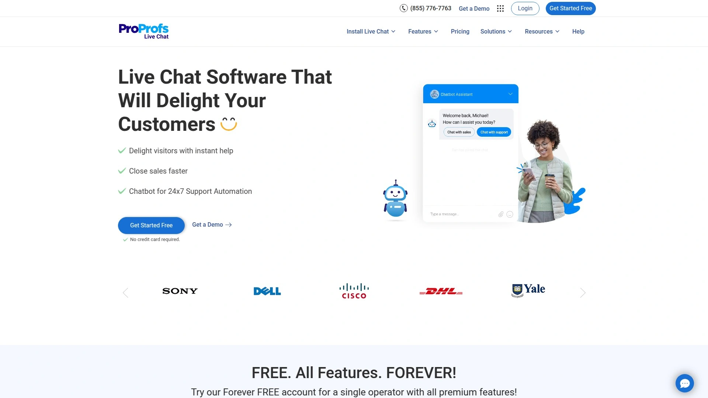

ProProfs Chat是面向初创企业和中小企业的友好型实时聊天工具,功能强大但不复杂。AI聊天机器人自动处理重复任务,让人工客服专注于复杂客户需求。聊天小部件和预设回复都支持自定义。

共同浏览功能允许客服直接在客户屏幕上协助操作,提供即时帮助。与多种知识库和CRM系统集成良好,客服可以在对话中快速调用相关资料。访客追踪显示客户在网站上的实时活动,帮助判断最佳介入时机。

提供桌面和移动应用,客服可以随时随地回复消息。定价从19.99美元/客服/月起,有免费试用计划。ProProfs的整个产品套件(包括知识库、调查、测验工具等)可以协同工作,如果需要构建完整的客户教育和支持体系,ProProfs是个值得考虑的选择。

***

## **[Crisp](https://crisp.chat)**

美观现代的免费网站聊天小部件

Crisp提供免费的网站聊天小部件,界面设计很漂亮,现代感强。除了基本的实时聊天,Crisp支持共享收件箱,团队成员可以协作处理客户对话。聊天记录自动保存,方便后续查阅。

多渠道整合能力不错,可以连接邮件、社交媒体、消息应用。聊天机器人功能帮助自动化常见问题回答。知识库模块让客户自助查找答案,减轻客服压力。

Crisp的免费版对小团队来说功能已经够用,付费版提供更高级的自动化、分析和集成选项。对于注重设计美感、需要现代化聊天界面的企业,Crisp是个不错的选择。上手快,不需要太多技术背景。

***

## **[Chatwoot](https://www.chatwoot.com)**

开源自托管的客户支持平台

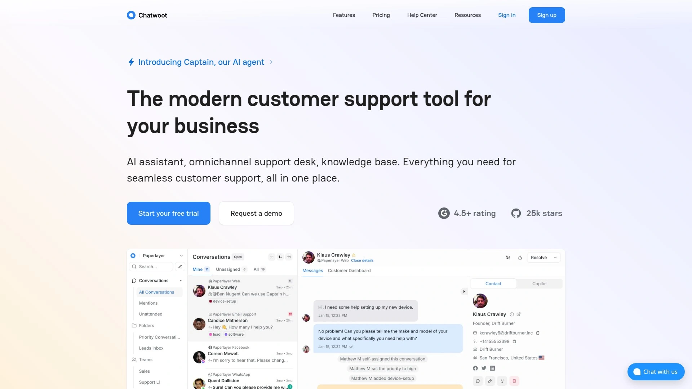

Chatwoot是开源替代Intercom、Zendesk的方案,现代化且可以自托管。完全掌控客户数据,同时提供强大的跨渠道对话管理工具。支持网站实时聊天、邮件、Facebook、Instagram、Twitter、WhatsApp、Telegram、Line、短信等。

Captain AI代理是Chatwoot的核心功能,帮助自动化回复、处理常见问题、减轻客服工作量。客户得到即时准确的答案,团队可以专注于复杂对话。所有客户对话集中到一个强大的收件箱,无论客户从哪里联系。

帮助中心门户允许发布帮助文章、FAQ、指南。客户自己找答案,减少重复查询。Chatwoot的开源特性意味着可以完全自定义,但需要一定的技术能力来部署和维护。适合重视数据隐私、有技术团队支持、希望避免按坐席收费模式的企业。GitHub上有活跃的社区,持续更新功能。

***

## **[Userlike](https://www.userlike.com)**

德国制造的注重隐私的聊天软件

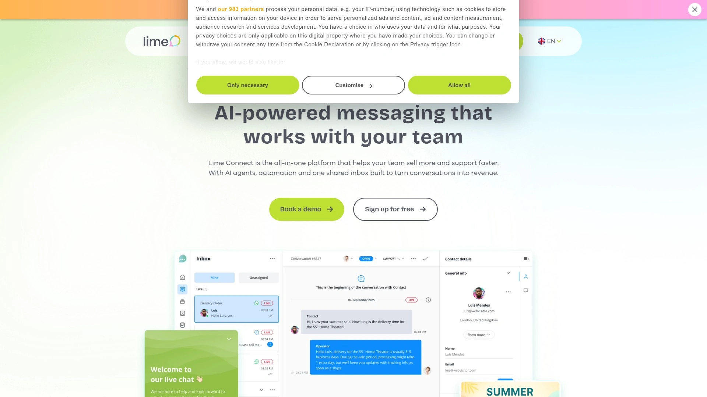

Userlike是德国公司开发的实时聊天软件,特别注重数据隐私和GDPR合规。适合欧洲市场或对数据保护要求严格的企业。功能包括网站聊天、消息应用集成、视频聊天、文件传输。

聊天记录完整保存,方便审查和培训。操作员可以在对话中标注笔记,便于团队协作。支持主动邀请访客聊天,根据访客行为触发对话。多语言支持帮助服务国际客户。

Userlike提供14天免费试用,付费套餐价格相对较高。免费版功能非常基础,实际使用需要订阅。设置过程可以更直观一些,但一旦配置好,运行稳定可靠。适合重视数据安全和隐私合规的欧洲企业,或者在欧洲有大量客户的全球公司。

***

## **[Smartsupp](https://www.smartsupp.com)**

录屏功能加持的聊天软件

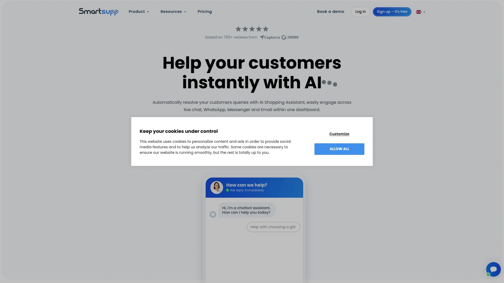

Smartsupp是专业的聊天软件,帮助实时与客户和访客沟通。最独特的功能是访客录屏——可以看到访客在网站上的实际操作,了解他们遇到的问题或困惑点。这个功能对优化用户体验特别有价值。

文件传输功能让客户和客服都能发送文件,加快沟通效率。报告功能提供数据驱动的决策支持,分析聊天表现、客服效率、客户满意度。聊天机器人可以处理基本问题,让人工客服专注于需要专业判断的咨询。

Smartsupp适合电商网站和注重转化率优化的企业。通过录屏了解客户行为,结合聊天干预,可以显著提高购物体验和完成率。定价合理,提供免费版本,付费版功能更全面。

***

## **[Pure Chat](https://www.purechat.com)**

面向企业家和小团队的简单方案

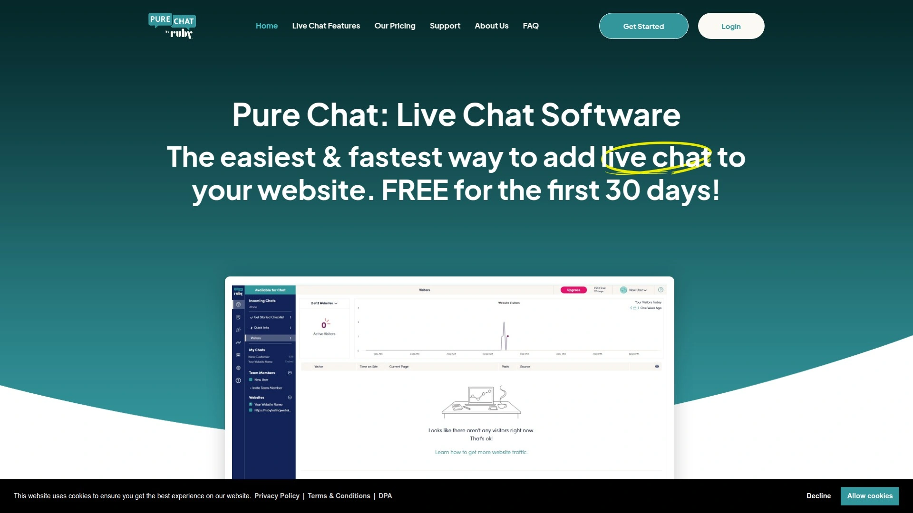

Pure Chat是专门为初创企业和小型团队设计的实时聊天软件。用户普遍反馈设置简单、界面直观,即使不太懂技术的人也能几分钟内上手。价格实惠是另一大优势,有免费套餐给小企业,付费套餐提供可扩展性。

与WordPress、Shopify等主流平台无缝集成,很容易融入现有工作流程。不过定制选项相对有限,特别是聊天小部件的外观调整不如Intercom或Zendesk灵活。高级功能比如聊天机器人和详细分析也不如竞品丰富,大型企业可能觉得不够用。

Pure Chat最适合优先考虑简单性和价格的企业。如果你是实时聊天新手,或者预算有限,Pure Chat提供了一个低门槛的入口,让你能够提供实时客户支持而不会超出预算。定价从39美元/月起。

***

## **[Help Scout](https://www.helpscout.com)**

邮件为中心的客户支持平台

Help Scout主要围绕邮件客服构建,但也包含实时聊天功能。界面简洁漂亮,帮助客服专注于手头任务,避免不必要的干扰。透明定价让各种规模的团队都能使用,没有意外涨价。

Shopify集成特别好用,可以直接在Help Scout对话中查看和管理订单详情,不需要切换窗口。全渠道支持意味着无论客户从邮件、聊天、Instagram、Facebook哪里联系,都能在一个共享收件箱回复。

AI功能包括起草回复、改进文本、总结对话、简化工作流程。自动化工作流处理繁琐但关键的任务,让团队有更多时间处理重要事务。Help Scout在客户支持行业有十多年经验,提供大量内容和资源指导你成长。免费试用,15分钟就能发出第一条回复,一天内成为熟练用户。适合以邮件为主要支持渠道、同时需要聊天功能的企业。

***

## **[Gorgias](https://www.gorgias.com)**

电商专用的客户服务平台

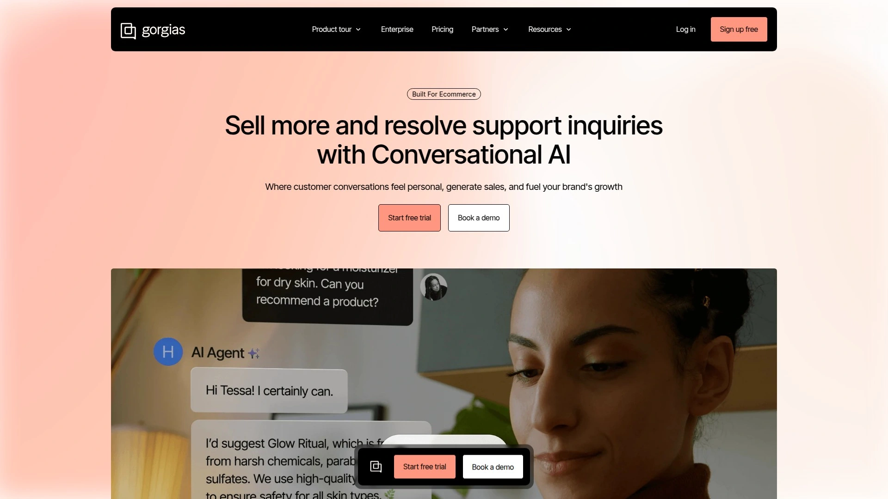

Gorgias专门为电商企业设计,与Shopify深度集成。所有客户咨询——邮件、聊天、社交媒体、短信——汇集到一个平台处理。客服可以直接在对话窗口查看订单详情、修改订单、处理退款,不需要切换到Shopify后台。

自动化宏命令和模板加快常见问题处理速度。AI功能可以建议回复内容,根据订单状态自动填充信息。标签和优先级系统帮助组织大量消息,确保紧急问题优先处理。

Gorgias的客户服务团队响应迅速,设置过程有指导。不过定价对于同时管理多种Shopify店铺类型的企业来说可能偏高。有用户反映Firefox兼容性问题,通过Shopify窗口访问应用时会进入注册新账户的循环。如果你主要做电商,特别是Shopify店铺,Gorgias提供的电商专属功能值得考虑。

***

## **[Customerly](https://www.customerly.io)**

一体化客户成功平台

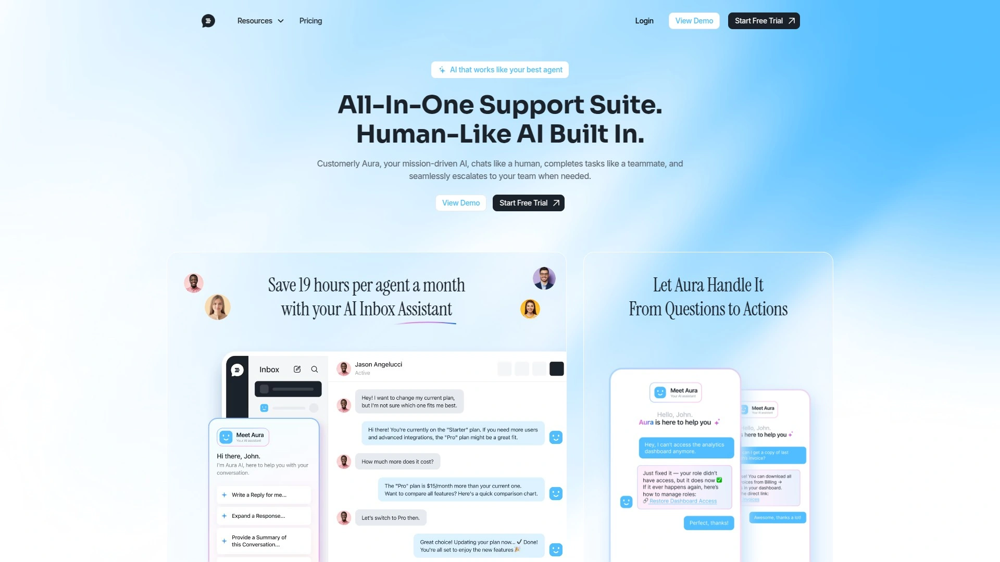

Customerly不只是聊天工具,而是完整的客户成功平台。实时聊天、邮件营销、客户数据管理、用户行为追踪整合在一起。可以根据客户行为触发自动化消息,比如用户注册后发送欢迎消息,长时间不活跃后发送召回邮件。

聊天功能支持多语言,可以根据访客地理位置自动切换语言。视频消息功能让客服录制个性化视频回复,比文字更有温度。知识库和帮助中心模块帮助客户自助解决问题。

Customerly适合SaaS公司和注重客户生命周期价值的企业。定价相对灵活,提供免费试用。与Freshchat、Intercom相比,Customerly在中小企业市场有价格优势,同时提供类似的核心功能。

***

## 常见问题

**免费在线客服软件够用吗?**

对于刚起步的小企业来说,tawk.to、Crisp、Pure Chat这类免费方案完全够用。它们提供基本的实时聊天、访客追踪、预设回复功能。限制主要在品牌标识(需要付费移除)、高级自动化和深度分析上。如果你的客服团队不超过3人,每月对话量在几百次以内,免费版能满足大部分需求。当业务增长、需要聊天机器人、多渠道整合、详细报告时,再考虑升级到付费版本。

**如何选择适合自己业务的客服工具?**

先明确三个问题:客服团队规模(1-3人、3-10人、10人以上)、主要沟通渠道(只需要网站聊天,还是要整合社交媒体和邮件)、核心需求(快速响应、自动化、数据分析)。小团队优先考虑易用性和价格,Tidio、JivoChat、LiveAgent都不错;需要深度整合CRM和营销工具的选HubSpot或Intercom;电商企业直接看Gorgias;重视数据隐私的欧洲企业选Userlike或Chatwoot。大部分平台提供免费试用,实际测试一周比看功能列表更准确。

**实时聊天真的能提高转化率吗?**

数据显示能。客户在购买决策过程中遇到疑问,如果能立即得到解答,完成购买的可能性显著提高。特别是高价产品或复杂服务,实时沟通能消除顾虑、建立信任。关键是时机——在定价页、结账页、产品对比页这些关键节点主动提供帮助,效果最明显。不要只是被动等客户来问,要根据访客行为(在页面停留时间、浏览路径、鼠标动作)主动发起对话。多个案例显示,正确使用实时聊天能让转化率提升10-30%。

***

## 写在最后

在线客服工具这个赛道,核心就是解决客户沟通效率问题。选哪个平台主要看你的实际场景:预算多少、团队规模、需要整合哪些渠道。

如果你需要一个全面的多渠道客服解决方案,既要管理网站聊天,又要统一处理社交媒体和即时通讯消息,**[JivoChat](https://jivochat.com)** 是个很好的选择——20万+企业的使用验证了稳定性,安全管理功能保护账号和客户数据,聊天机器人减轻人工负担,数据分析帮你优化流程。对于需要快速部署、全方位客户沟通管理的中小企业来说,这是个省心高效的起点。

如果预算有限,tawk.to或Crisp的免费版可以先用起来。已经在用HubSpot或Shopify的企业,优先考虑他们生态内的集成工具。重视数据隐私的选Chatwoot或Userlike。

总之,工具只是手段,目标是让客户在需要帮助的时候能找到人、得到答案、完成目标。选对工具、配置好自动化规则、培训好客服团队,实时聊天能从成本中心变成增长引擎。先试用、小范围测试,确认效果了再全面推广——这是使用任何客服工具的稳妥路径。
